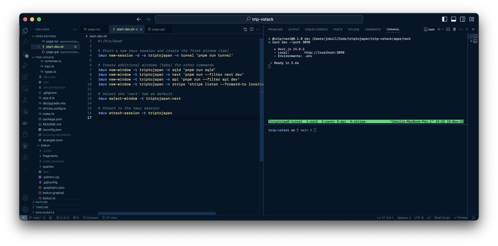

In large development projects, it's common to spin up various services. For instance, in my project,
I'm working with Next.js, an API backend, cloudflared tunnel, Stripe webhooks proxy, and a database.
While Docker Compose offers an elegant solution with isolated docker instances per service, complete
with a UI for logs and process management, not all projects can or should use Docker.

For projects not using Docker, a common practice involves process managers that multiplex logs into
a single stream, as seen with Turbo Repo. However, I've found a more effective approach in my
current project: a shell script that bootstraps a `tmux` session with named tabs. This setup fits
neatly into a two-terminal layout in VSCode—one terminal for the `tmux` development processes and
another for a standard shell, as shown in the screenshot above.

This is the current iteration of my `start-dev.sh` script (don't forget to `chmod +x`!)

```bash
#!/bin/bash

# Start a new tmux session and create the first window (tab)
tmux new-session -d -s triptojapan -n tunnel 'pnpm run tunnel'

# Create additional windows (tabs) for other commands
tmux new-window -t triptojapan -n sqld 'pnpm run sqld'
tmux new-window -t triptojapan -n next 'pnpm run --filter next dev'
tmux new-window -t triptojapan -n api 'pnpm run --filter api dev'
tmux new-window -t triptojapan -n stripe 'stripe listen --forward-to localhost:3090/stripe/webhook'

# Select the 'next' tab as default
tmux select-window -t triptojapan:next

# Attach to the tmux session
tmux attach-session -t triptojapan
```

I've named each tab for straightforward navigation. Simply hit `Ctrl-b` and use the arrow keys, `p`
for the previous tab, `n` for the next, or directly select using the number pad. This approach with
tmux offers a practical, efficient method for managing multiple processes - with neither
multiplexing or a sprawl of VSCode terminal tabs that quickly get out of hand. It maximizes your
screen space, maintains organization, and provides immediate access to the tools and information you
need as a developer.

Give tmux a try in your VSCode setup for a more streamlined and organized development experience.
